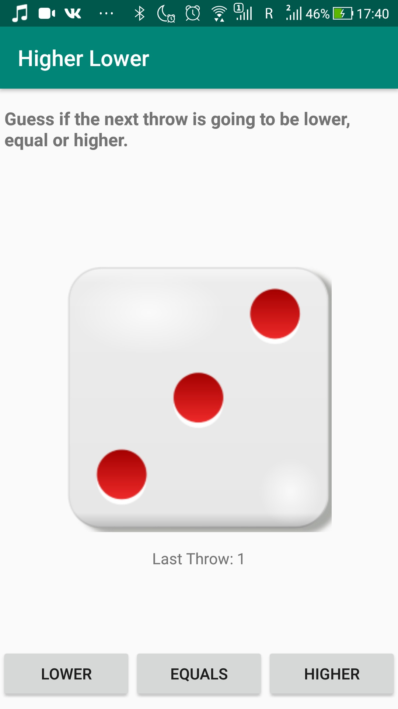
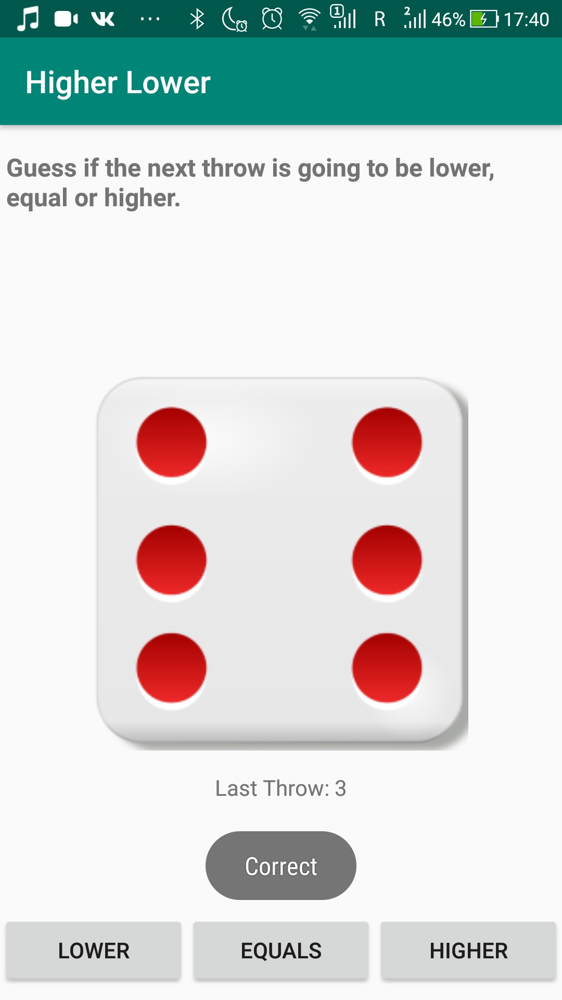

# Level 1 Learning Task 1 - Higher-lower app
This is the first task that we had to do (almost) on our own in this course.
## What's inside
That's a higher-lower dice roll app. The user has to guess if the next number of the dice is higher, equal or lower than the current number. He does that by pressing the corresponding button.
The dice throw is generated randomly.
The user gets informed about winning or losing with the help of Toast messages.
The last throw is registered in a TextView.
## Screenshots
    
